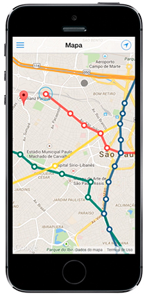

# Siga

Siga is a - protototype of - a mobile web app I made for a college project whose main goal is to offer a single source of information for people who use Sao Paulo's subway system.

[](https://cloudup.com/cqn4fjWT1oF)
<sup>Click on the image to see a demo of Siga in action</sup>

# The idea

I was born in Sao Paulo and been using the subway system for years now. The company behind it is called [SPTrans](http://www.sptrans.com.br). Even though there are some really good services that are offered by them, their communication with the average subway user is terrible, so people don't even know what's going on. That lack of better communication is what caught my attention.

For many reasons, when I want to get some information about public transportation, what comes to my mind is terrible websites and confusing information. I believe that any individual should be able to check the train operational status and directions to a specific subway station without the need of a desktop computer with Internet Explorer 6 installed (hello Brazilian government websites!).
There are already some mobile options available but none of them combine all of the information about the system into a single place.

This project is a proof of concept that we can have simple, beautiful and efficient solutions even though the source of information is a mess. There are so many great examples out there; [CityMapper](https://citymapper.com) is one of them which I produly have used as a benchmark.

As *cliché* as it sounds, I've tried to combine design and technology to provide a concrete solution for the problem.
This prototype of mobile web app is the result of the effort I've put into interviews with real people, benchmark research, UI sketching and prototyping.

[Here are the slides explaining the whole project (in Brazilian Portuguese only).](https://speakerdeck.com/rafaelrinaldi/projeto-de-conclusao-de-curso)

# Challenges

For many times, I've underestimated the efforts to make this project happen. To list some of them:

  * Lack of benchmarks matching the same context;
  * I had an idea that the data I needed was going to be difficult to get, but the scenario was **way worse** than I thought. That's why before I even started working on the web app, I've created [Malaco](http://github.com/rafaelrinaldi/malaco) - a normalized API to access the data from Sao Paulo's subway system;
  * Providing a visual solution for such problem was a really difficult task. Putting all the information together, creating UI patterns for similar features, etc.

# Future

Siga is much more than this prototype. I've picked the subway system because it's something present in my life on a daily basis. With Siga I realized that I can go beyond that and also improve the way users get information about train and bus systems as well. The data is there, there are great stuff being offered by the companies who run the systems and the problem is there as well!

Siga's goal is to be the best tool for using public transportation - of any kind - in Sao Paulo.

I'm already working on a new prototype of a more robust version of the project. I really want to improve the user experience, specially the UI. I've spent a lot of time working on [Malaco](http://github.com/rafaelrinaldi/malaco), figuring out where and how to fetch the data needed that I didn't had much time left to work on the visuals.

# Technology

  * [Sass (w/ SCSS syntax)](http://sass-lang.com) as CSS pre-processor;
  * [Autoprefixer](https://github.com/postcss/autoprefixer) to handle CSS vendor prefixes;
  * [Bower](http://bower.io) as client side package manager;
  * [Gulp](http://gulpjs.com) as the task runner of choice;
  * [Ionic](http://ionicframework.com) as the mobile UI kit;
  * The data is provided by [Malaco](http://github.com/rafaelrinaldi/malaco);
  * [Vue](http://vuejs.org) is a MVVM framework, useful for dynamic DOM manipulation;
  * [AMD](http://en.wikipedia.org/wiki/Asynchronous_module_definition) module system;
  * [RequireJS](http://requirejs.org) as module loader.

## Running the project

If you want to run the project locally, you must have [Node.js](http://nodejs.org) installed (with [NPM](http://npmjs.com)) and a global install of [Bower](http://bower.io) as well. To install them both:

```sh
λ brew install node # Install Node.js via Homebrew
λ curl https://www.npmjs.org/install.sh | sh # Install NPM
λ npm install bower -g # Finally install Bower globally through NPM
```

Then, install all the dependencies:

```sh
λ npm install
λ bower install
λ gulp # The default task compiles all the assets and will serve them to the localhost
```

To run the project in production mode (minified assets):

```sh
λ NODE_ENV=production gulp
```

# Contributing

The reason why I've open sourced this project is because I would love to get some feedback on the work I've done here. Open an issue and let's discuss ideas!

I'm usually online so also be free to get in touch via [Twitter](http://twitter.com/rafaelrinaldi) and [Skype](skype:rafaelrinaldi).

# Credits

Special thanks to these folks, this project wasn't going to be possible without them:

  * [Luciano Tavares](https://twitter.com/lucianot)
  * [Fabio Silveira](https://twitter.com/fabionsilveira)
  * [Vinicius Pellegrino](https://twitter.com/vinigp)

# License

[MIT license](http://rinaldi.mit-license.org).
